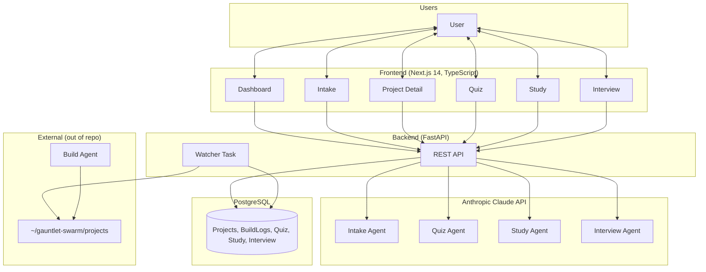
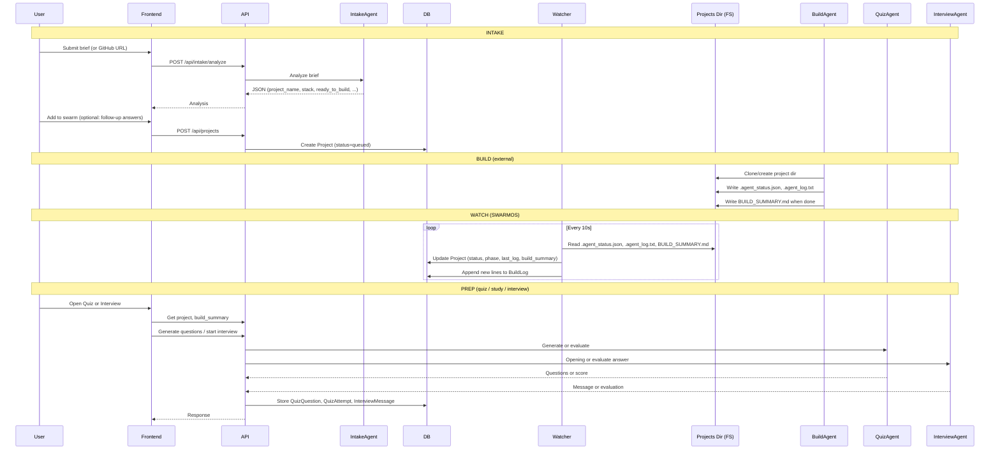
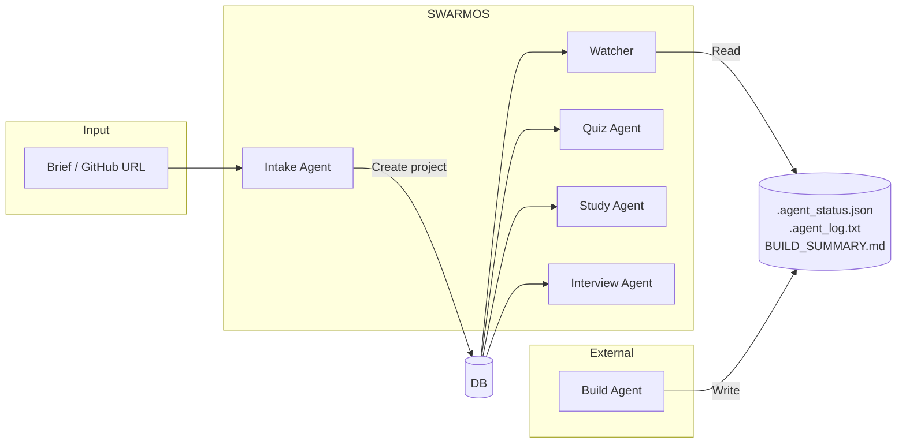

# SWARMOS Architecture

This document describes how SWARMOS was built: components, AI agents, data flow, and methods.

---

## 1. What SWARMOS Is

**SWARMOS** is an **AI-powered project control plane** for studying and interview prep. It:

- **Intake**: Accepts project briefs (or GitHub repos), analyzes them with AI, and queues projects for build.
- **Observes**: Watches an external build process (filesystem) and syncs status, logs, and build summaries into the app.
- **Prep**: After a project is built, supports **quiz** (project-specific Q&A), **study** (custom content → generated questions), and **interview** (simulated technical/behavioral interviews).

So SWARMOS does **not** run the actual code-generation/build agent. It is the **orchestration and prep layer** around it.

---

## 2. High-Level Architecture

---

## 3. AI Agents and Their Roles

| Agent | Where | Model | Role |
|-------|--------|--------|------|
| **Intake Agent** | `backend/routers/intake.py`, `backend/services/intake.py` | `claude-sonnet-4-20250514` | Senior AI engineer: analyzes a project brief, extracts structured JSON (project_name, company, stack, key_features, missing_info, follow_up_questions, ready_to_build, estimated_minutes). Can refine with follow-up answers. |
| **Quiz Agent** | `backend/services/quiz_engine.py` | `claude-sonnet-4-20250514` | Technical interviewer: generates project-specific questions (architecture, code, system_design, flashcard, code_walkthrough) at levels 1–5; evaluates user answers. |
| **Study Agent** | `backend/services/study_engine.py` | `claude-sonnet-4-20250514` | Study coach: given session title + content (or URL), generates multiple-choice questions and explanations to test understanding. |
| **Interview Agent** | `backend/services/interview_engine.py` | `claude-sonnet-4-20250514` | Simulated interviewer: persona (coaching / balanced / faang), company style (e.g. Stripe, Google), interview type (behavioral, technical, coding, system_design). Generates opening question and evaluates each answer with score + feedback. |
| **Build Agent** | **External** (not in this repo) | — | Runs in each project directory under `~/gauntlet-swarm/projects/<project_id>`. Writes `.agent_status.json`, `.agent_log.txt`, and `BUILD_SUMMARY.md`. SWARMOS only **reads** these; it does not run or configure this agent. |

**Gauntlet-Swarm.** The external build agent is part of **gauntlet-swarm**, a separate system (not in this repo). The initial 9 projects in SWARMOS were built by gauntlet-swarm using a multi-agent setup (on the order of dozens of agents across those projects). SWARMOS only observes build output via the Watcher; it does not run or configure gauntlet-swarm.

---

## 4. End-to-End Flow (Methods)

---

## 5. Watcher: How Build Status Gets Into SWARMOS

The **Watcher** (`backend/services/watcher.py`) is a background task started in `main.py` lifespan. Every **10 seconds** it:

1. For each project in the DB, resolves `PROJECTS_DIR` (default `~/gauntlet-swarm/projects`) + `project.id`.
2. If that directory exists:
   - Reads **`.agent_status.json`** → `status`, `phase`, `last_action`.
   - Reads **`.agent_log.txt`** → last log line; new lines appended to **BuildLog** in DB.
   - Reads **`BUILD_SUMMARY.md`** → stored in `Project.build_summary` (used by Quiz and Interview).
   - Counts files in the project dir → `Project.files_count`.
3. Updates **Project**:
   - `status`: `complete` → done, `error` → error; else if `files_count > 10` and was queued → building.
   - `phase`, `last_log`, `elapsed_seconds`, `started_at`, `completed_at` as appropriate.

So the **method** is: **filesystem as contract**. The external build agent and SWARMOS agree on directory layout and file names; no direct API between them.

---

## 6. Data Model (Core)

- **Project**: id, name, company, stack, port, status (queued | building | testing | done | error), phase, files_count, live_url, github_url, last_log, build_summary, brief, estimated_minutes, elapsed_seconds, started_at, completed_at, …
- **BuildLog**: project_id, message, level, phase — filled by Watcher from `.agent_log.txt`.
- **QuizQuestion** / **QuizAttempt**: project-scoped; Quiz Agent generates questions, backend records attempts.
- **StudySession** / **StudyQuestion**: user-provided content; Study Agent generates questions.
- **InterviewSession** / **InterviewMessage**: project + type + difficulty; Interview Agent generates opening and evaluates each answer.

---

## 7. Summary Diagram: Agents and Methods

**Agents used:** Intake (analyze brief), Quiz (generate + evaluate questions), Study (generate questions from content), Interview (persona + evaluate). **Build** is an external agent; SWARMOS uses a **Watcher** that reads from the filesystem to reflect build status and logs in the app.

---

## 8. Where Things Live in the Repo

| Concern | Location |
|--------|----------|
| Intake (analyze, refine) | `backend/routers/intake.py`, `backend/services/intake.py` |
| Projects CRUD, GitHub import, log import | `backend/routers/projects.py` |
| Watcher (sync status from disk) | `backend/services/watcher.py` |
| Quiz (generate questions, submit answer) | `backend/routers/quiz.py`, `backend/services/quiz_engine.py` |
| Study (sessions, generate questions) | `backend/routers/study.py`, `backend/services/study_engine.py` |
| Interview (start, message, evaluate) | `backend/routers/interview.py`, `backend/services/interview_engine.py` |
| Models & DB | `backend/models.py` |
| Frontend pages | `frontend/src/app/` (page.tsx, intake, quiz, study, interview, projects/[id]) |
| API client | `frontend/src/lib/api.ts` |

This is the full architecture of what was built for SWARMOS: one control plane, four in-repo AI agents (intake, quiz, study, interview), one external build agent, and a filesystem-based watcher to tie build output into the app.
